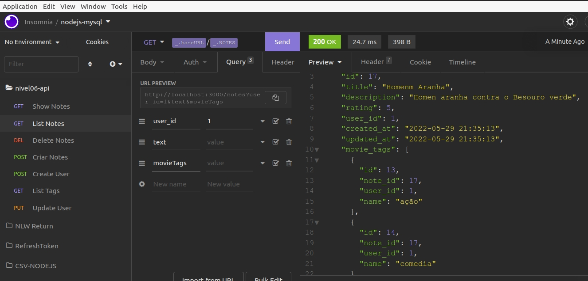

# Backend Filmes

- Criar uma aplicação em Node.js onde o usuário cadastra um filme, preenche com algumas informações (nome, descrição, nota) e cria tags relacionadas a ele.
  Abaixo, temos um diagrama - Base de Dados - Montar o diagrama usando o site [drawsql](https://drawsql.app/home).
  

### Explicando cada tabela e seus campos:

| Tabela de usuários (users) |     | Tabela de anotações de um filme (movie_notes) |     | Tabela de tags (movie_tags) |
| -------------------------- | --- | --------------------------------------------- | --- | --------------------------- |
| id                         |     | id                                            |     | id                          |
| nome do usuário            |     | título do filme                               |     | id da anotação              |
| e-mail do usuário          |     | descrição do filme                            |     | id do usuário               |
| senha do usuário           |     | nota que o usuário deu para o filme\*         |     | nome da tag\*\*             |
| avatar do usuário          |     | id do usuário                                 |     |                             |
| data de criação            |     | data de criação                               |     |                             |
| data de edição             |     | data de edição                                |     |                             |

\*Valores inteiros que podem variar de 1 até o 5.
\*\*Exemplos: ação, comedia, terror, medo...etc.

---

### **Observações:**

- Ao subir o projeto no GitHub, a pasta **node_modules** não precisa ser enviada, já que, consegue-se facilmente criá-la no projeto usando `npm install`.
- Para isso crie um arquivo chamado **.gitignore** na raiz do projeto e adicione o texto _node_modules_ nele.

### Alguns detalhes

- Criptografia de senhas;
- Validação de e-mail;
- Aplicar o cascade para garantir que uma tag será excluída caso o usuário opte por excluir a nota.

### Entrega

- Esse desafio deve ser entregue a partir da plataforma da Rocketseat enviando o link do CodePen e/ou GitHub com o código ou criar um documento público no Notion anexando os arquivos e enviando.

---

- Executar: `npm install` para criar a pasta `node_modules`

- Migrations para Movie_Notes e Movie_Tags - Criar mais duas migrations no projeto que proverá as tabelas movie_notes e movie_tags no banco de dados.

  - `npx knex migrate:make createMovieNotes`
  - `npx knex migrate:make createMovieTags`
  - Rodar o script: `npm run migrate`

    
    
    
    

## Testando tudo

- 1. Excluir o banco de dados
- 2. parar o servidor
- 3. Reiniciar: `npm run dev`
- 4. Rodar o script da migration: `npm run migrate`
- 5. Criar um usuário no insomnia
     
- 6. Testar email único
     
- 7. Testando criar Movie Notes
     
     
- 8. Testando excluir notas
     
- 9. Testando ver uma nota
     
- 9. Testando listar todas as notas
     
- 9. Testando listar todas as movie tags
     
- 10. Testando atualizar usuário
      
      

---
